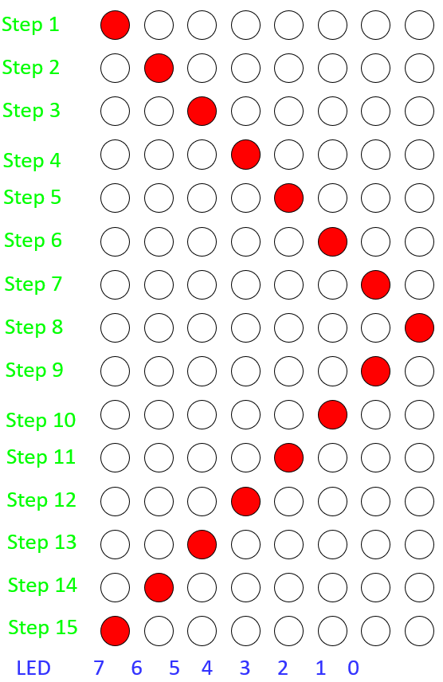

# First Day

## Hello, World (Assembler-Version)

The objective in our "Hello, World" programs is to
let an led blink. The `LED should be on` for about `100ms` and `then off` for about `900ms`.

```assembler
    list p=PIC16F877A
    #include <p16F877A.inc>
    
    __CONFIG _CP_OFF & _WDT_OFF & _HS_OSC & _LVP_OFF & _BODEN_OFF
    
DelayTemp	EQU     0x20    ; address of free ram register
RES_VECT    CODE    0x0000  ; processor reset vector
    GOTO    START           ; go to beginning of program

MAIN_PROG CODE              ; let linker place main program
    ;   The specific code of an application goes here
    END
```

We started by creating a new project in MPLAB X and created a file containing the code above. Most of the code will always be the same, but the first three are specific to the target chip (in our case a _PIC16F877A_). We used the `__CONFIG` directive to set some settings for the chip. The fourth line is specific to our code and defines a register used by our delay subroutine. With this alias being set we make it less likely that the register is used by accident.  
To cover this application I will firstly go through all the sub routines that are implemented.

### 1. DelayW

> ToDo: explain how DelayW works

The `DelayW` subroutine delays the further execution of the code by a specified amount of milliseconds. To specify that time we have to use two statements:

```assembler
movlw	    D'100'      ;   move the amount of milliseconds to the accumulator
call	    DelayW      ;   call DelayW to wait the specified time
```

### 2. Delay900

As we target a microcontroller that is not capable of handling values greater than `255` we need a workaround for the 900ms duration in which the LED should be turned of. We simply call the `DelayW`-Subroutine for four times and always set duration to `255` which totals to a delay $255ms \bullet 4 = 1020ms$. 

### 3. Initialize for Hello, World
> ToDo: Wozu bsf & bcf?
```assembler
Initialize
    bsf	    STATUS,RP0
    movlw   B'11111110'
    movwf   TRISB
    bcf	    STATUS,RP0
    clrf    PORTB
    return
```

In order to use the digital pins we have to set the pin its mode to output. We do that in the third and fourth line of the snippet by writing a byte in the accumulator that has a `0` as its LSB. The LSB is responsible for the pin `0` that we are going to use. The remaining values control other pins in that port, but as we don't use them the values set here are not really important.
The last statement sets the value of all pins in port b to low in case some pins initialized with one.

### 4. Hello, World

```assembler
START
    call        Initialize
    Loop    
    bsf		    PORTB,0
    movlw	    D'100'
    call	    DelayW
    bcf		    PORTB,0
    call	    Delay900
    GOTO Loop
```

The `START`-Routine is where things go together. The second statement calls the previously discussed `Initialize`-routine so that we can use the digital pin 0 directly in line three. But at this point we first define a new subroutine called `Loop` so that we can jump to this point later. We use `bsf` to turn on a LED and `bcf` to turn it off again. Between the two calls we use the discussed calls to `DelayW` and `Delay900`. The last statement `GOTO Loop` is responsible for the endless loop that we need for the desired behaviour.

## LED Shifter (Assembler-Version)

Due to missing time during the lesson we had to complete this project alone at home.  
It was the target to subsequently turn on all pins on one port according to the following image.


### 1. Initialize for the LED-Shifter

The code necessarry for this application is nearly the same as that used in the Hello, World application.

```assembler
Initialize    
    movlw   0b00000000
    movwf   TRISB
    movlw   0b00000001
    movwf   PORTB
    return
```

In this case we need to use the whole bunch of pins provided by port b. As we need all to be outputs we load a byte with all bits set to 0 first into the accumulator and from there into the control register for trisistor b. Now that we have all pins in the correct mode we begin by loading the first correct state into the data register of port b. The first state is represented by the byte `0b00000001` as the LSB represents the first pin of the port.

### 2. StepUp & StepDown

`StepUp` and `StepDown` are two methods that move the active led one step to the left or to the right respectively. Both methods utilize a modified version of the `Delay900` method described earlier. As they are pretty similar I will show how they work with `StepUp` as an example.

```assembler
StepUp 
    rlncf    PORTB,1    ;   StepDown uses rrncf respectively
    call     Delay500
    return
```

Allthough this method looks pretty simple it introduced the first problems. It was a hint to use `rlf` as I tried to use that statement over `rlncf` I got compiler error but had problems understanding them. After countless useless answers in many forum threads I found out, that `rlf` is called `rlcf` in the instruction set used by the `PIC18F4520` microcontroller we are targeting here.
But as I had replaced the calls I noticed that on the one hand the LEDs will turn on subsequently as they should but on the other hand they didn't turn off as they should. I figured out, that the reason for that was the carrying behaviour of that instruction. I found another called `rlncf` which does the job pretty god as it doesnt care if whether an overflow happens.

### 3. Configuration

Another problem I encountered was that some pins were initilized as analog rather than digita outputs. For some reason I wasn't able to see outputs on those pins. The solution was it to change the configuration with

```assembler
CONFIG  PBADEN = OFF
```

### 4. Shift the LEDs

As a first approach I went with a rather primitive solution to the problem as I took the boilerplate code from the first application, implemented the methods described above and added 14 method calls like so

```assembler
START
    call    Initialize
    Loop		    
    call    StepUp      ;   repeat six times
    call    StepDown    ;   repeat six times
    GOTO    Loop
```


## Hello, World (C-Version)
