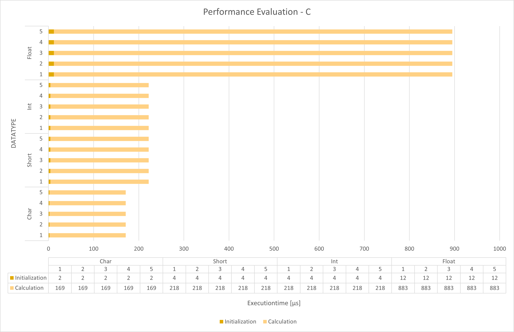
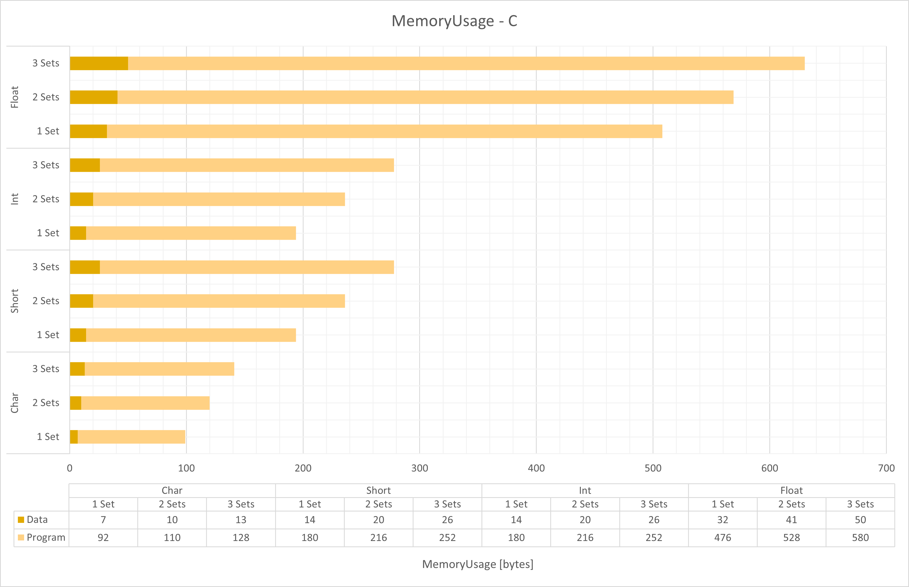
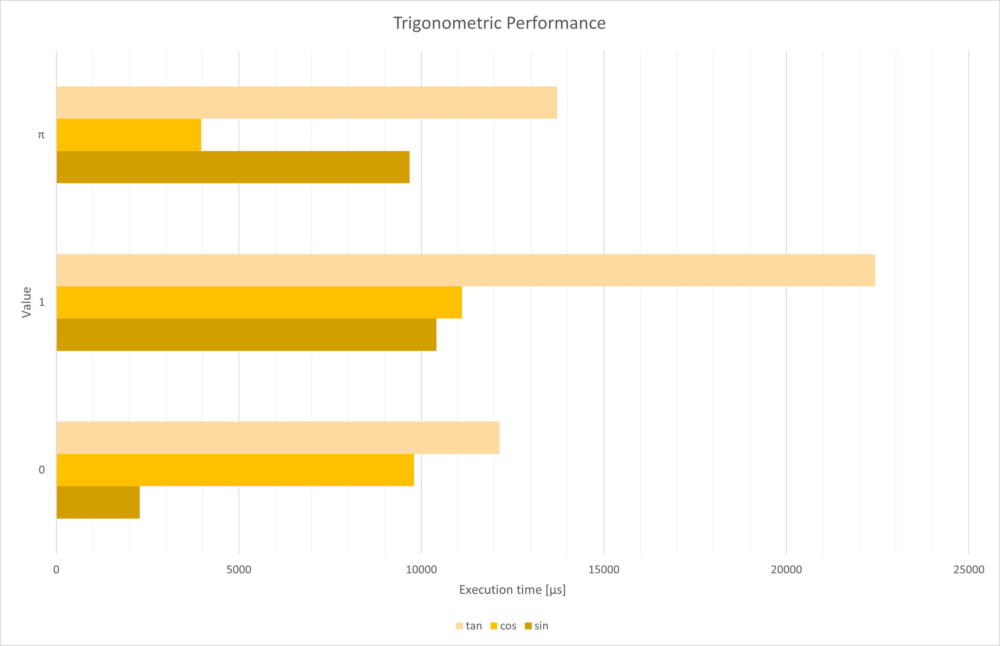

# Fourth Day

## Performance analysis

### Floating-Point division

My goal is it to say something about the differences in execution speed and memory requirement when using floating point numbers over integer arithmetic. If I would do that in my _mother tongue_ `C#`, I would implement it the following way:

```csharp
static void Main(string[] args)
{
    var rolex = new Stopwatch();
    var measurements = new List<float>();
    for (int i = 0; i < 100000000; i++)
    {
        rolex.Start();
        var K = 187f;
        var M = 257f;
        var N = K / M;
        rolex.Stop();
        measurements.Add(rolex.ElapsedTicks);
        rolex.Reset();
    }
}
```

After that I would set up a breakpoint to see what is written inside of the `measurements` list. If I do that, I get the following findings:

1. The measured Values differ a lot (0 Ticks to 8340 Ticks with an average of about 0.6 ticks)
2. With one tick beeing just 100ns, I have serious doubt that the measurements are precise (the minimum is 0)

To do the same thing with our microcontroller programs, we have to use MPLAB X which has a stopwatch feature integrated. The same programm in C would look like the following:

```c
void main(void) {
    Nop();
    DATATYPE K = 187;
    DATATYPE M = 257; 
    Nop();
    DATATYPE N = K / M;
    Nop();
    
    return;
}
```

To measure the duration the execution of multiple statements took, we have to open the Stopwatch pane located at Window > Debugging > Stopwatch. After that we need to set up some breakpoints on the statements between which the execution time should be measured, as sometimes the software bugs when applying breakpoints on arithmetric statements, I use `Nop()`s to apply breakpoints. The execution of one `Nop()` always takes one cycle which equals one microsecond, which when using an one megaherz crystal, equals one microsecond. We need to subtract this time from the measured time. Unfortionally, MPLAB X is not able to measure programatically, so I will repeat the measurement just five times rather than a hundred million times. We measure the time required for the variable initialization and the actual calculation separately. And as the measurements from my C# code are so unreliable, I won't include them and just remember my finding: "The execution time in C# varies a lot".



As you can see from my measurements, the C code takes exactly the same amount of time for both the initialisation and calculation phase over all five test cycles and datatypes, which is a benefit in predictability over the C# solution.  
We can also see, that there is a slight increase in time when I switched from `char` (eight bit `integer`) to `short` (at least 16bit `integer`) which in my understanding comes from the fact that `short` handles at least two registers in stead of just one so we need twice the time for our initilisation and in every case _longer_ for the calculation.  
I guess, that the equality of the `short` and `integer` times come from the fact that are essentially the same in practice with a very low _propability_ of `int` beeing larger.  
The last datatype `float` shows us the reason, that many sensor libraries I know provide values not in integer values of hundreds of Units (e.g. 100°C) rather than using the Unit itself and a floating point numbers. `Float` needs six times longer than `char` to initialize and a bit more than five times longer to calculate.  
MPLAB X also allows us to evaluate the memory used by a certain program. The corresponding panel "{ProjectName} - Dashboard" is opened by default, all we have to do is to compile our program.



To see how the memory consumption scales, I took the discussed program (here the tests with 1 Set) and duplicated the code while renaming the variables so that we have two or three sets with three variables each. I thought, that there may be some sort of a benefit if there are already other variables as if the compiler needed to include certain libraries for either of the types. As all of the bars increase in a linear way and the delta is much smaller than the difference to another datatypes graph, this consideration seems to be true.  
However we can see, that using `float`s means a significantly larger amount of program and data memory needed.

### Trigonometry

I also did some tests using the trigonometric functions provided by `math.h`. I assumed, that there is a correlation betwen the parameter and the trigonometric functions value. To be clear I assumed, that `time(sin(0))` is about the same as `time(sin(π))` as they both have integer solutions and `time(sin(1))` to be significantly higher as the solution is floating point. The same should be true for `cos` and `tan` (of course with their respective values). I also assume, that the calculation of `tan` will alway take longer than both `sin` and `cos` as it is composed out of the others.



We can see, that the execution time differs by parameter value but there is no correlation to the solution the trigonometric function delivers.  
However the composition is clearly visible, as the `tan` bar is not only always the largest but also about the size of the other bars sticked to each other.