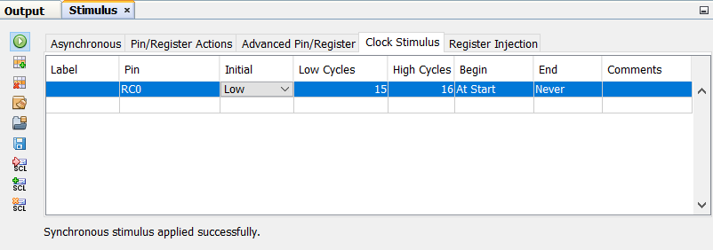

# Systemnahe Programmierung

## Disclaimer

I split the source code and the documentation 
according to the days we had to implement them.

## First Day

### Hello, World (Assembler-Version)

The objective in our "Hello, World" programs is to
let an led blink. The `LED should be on` for about `100ms` and `then off` for about `900ms`.

```assembler
    list p=PIC16F877A
    #include <p16F877A.inc>
    
    __CONFIG _CP_OFF & _WDT_OFF & _HS_OSC & _LVP_OFF & _BODEN_OFF
    
DelayTemp	EQU     0x20    ; address of free ram register
RES_VECT    CODE    0x0000  ; processor reset vector
    GOTO    START           ; go to beginning of program

MAIN_PROG CODE              ; let linker place main program
    ;   The specific code of an application goes here
    END
```

We started by creating a new project in MPLAB X and created a file containing the code above. Most of the code will always be the same, but the first three are specific to the target chip (in our case a _PIC16F877A_). We used the `__CONFIG` directive to set some settings for the chip. The fourth line is specific to our code and defines a register used by our delay subroutine. With this alias being set we make it less likely that the register is used by accident.  
To cover this application I will firstly go through all the sub routines that are implemented.

#### 1. DelayW

The `DelayW` subroutine delays the further execution of the code by a specified amount of milliseconds. To specify that time we have to use two statements:

```assembler
movlw	    D'100'      ;   move the amount of milliseconds to the accumulator
call	    DelayW      ;   call DelayW to wait the specified time
```

`DelayW` will then use a register and counts that down to zero which delays the execution by the in `W` stored amount of cycles.

#### 2. Delay900

As we target a microcontroller that is not capable of handling values greater than `255` we need a workaround for the 900ms duration in which the LED should be turned of. We simply call the `DelayW`-Subroutine for four times and always set duration to `255` which totals to a delay $255ms \bullet 4 = 1020ms$. 

#### 3. Initialize for Hello, World

```assembler
Initialize
    bsf	    STATUS,RP0
    movlw   B'11111110'
    movwf   TRISB
    bcf	    STATUS,RP0
    clrf    PORTB
    return
```

In order to use the digital pins we have to set the pin its mode to output. We do that in the third and fourth line of the snippet by writing a byte in the accumulator that has a `0` as its LSB. The LSB is responsible for the pin `0` that we are going to use. The remaining values control other pins in that port, but as we don't use them the values set here are not really important.
The last statement sets the value of all pins in port b to low in case some pins initialized with one.

#### 4. Hello, World

```assembler
START
    call        Initialize
    Loop    
    bsf		    PORTB,0
    movlw	    D'100'
    call	    DelayW
    bcf		    PORTB,0
    call	    Delay900
    GOTO Loop
```

The `START`-Routine is where things go together. The second statement calls the previously discussed `Initialize`-routine so that we can use the digital pin 0 directly in line three. But at this point we first define a new subroutine called `Loop` so that we can jump to this point later. We use `bsf` to turn on a LED and `bcf` to turn it off again. Between the two calls we use the discussed calls to `DelayW` and `Delay900`. The last statement `GOTO Loop` is responsible for the endless loop that we need for the desired behaviour.

### LED Shifter (Assembler-Version)

Due to missing time during the lesson we had to complete this project alone at home.  
It was the target to subsequently turn on all pins on one port according to the following image.
{ width=40% }

#### 1. Initialize for the LED-Shifter

The code necessarry for this application is nearly the same as that used in the Hello, World application.

```assembler
Initialize    
    movlw   0b00000000
    movwf   TRISB
    movlw   0b00000001
    movwf   PORTB
    return
```

In this case we need to use the whole bunch of pins provided by port b. As we need all to be outputs we load a byte with all bits set to 0 first into the accumulator and from there into the control register for trisistor b. Now that we have all pins in the correct mode we begin by loading the first correct state into the data register of port b. The first state is represented by the byte `0b00000001` as the LSB represents the first pin of the port.

#### 2. StepUp & StepDown

`StepUp` and `StepDown` are two methods that move the active led one step to the left or to the right respectively. Both methods utilize a modified version of the `Delay900` method described earlier. As they are pretty similar I will show how they work with `StepUp` as an example.

```assembler
StepUp 
    rlncf    PORTB,1    ;   StepDown uses rrncf respectively
    call     Delay500
    return
```

Allthough this method looks pretty simple it introduced the first problems. It was a hint to use `rlf` as I tried to use that statement over `rlncf` I got compiler error but had problems understanding them. After countless useless answers in many forum threads I found out, that `rlf` is called `rlcf` in the instruction set used by the `PIC18F4520` microcontroller we are targeting here.
But as I had replaced the calls I noticed that on the one hand the LEDs will turn on subsequently as they should but on the other hand they didn't turn off as they should. I figured out, that the reason for that was the carrying behaviour of that instruction. I found another called `rlncf` which does the job pretty god as it doesnt care if whether an overflow happens.

#### 3. Configuration

Another problem I encountered was that some pins were initilized as analog rather than digita outputs. For some reason I wasn't able to see outputs on those pins. The solution was it to change the configuration with

```assembler
CONFIG  PBADEN = OFF
```

#### 4. Shift the LEDs

As a first approach I went with a rather primitive solution to the problem as I took the boilerplate code from the first application, implemented the methods described above and added 14 method calls like so

```assembler
START
    call    Initialize
    Loop		    
    call    StepUp      ;   repeat six times
    call    StepDown    ;   repeat six times
    GOTO    Loop
```

The next was to reduce steps by using logic to determine the direction of the animation. I tried to solve the problem with the following (not working) snippet (I introduced two new help registers `Logic_Temp1` and `Logic_Temp2`). 

```assembler
btfss   ShiftLeft,0	    ; if ShiftLeft[0] == 0 {
call    StepUp	        ;   StepUp();
                        ; }

btfsc   ShiftLeft,0	    ; if ShiftLeft[0] == 1 {
call    StepDown        ;   StepDown();
                        ; }

movlw   0b00000001
btfsc   LATB,7	        ; W = LATB[7] == 1 ? 0b00000001 : 0b00000000
movlw   0b00000000
andwf   ShiftLeft,0	    ; W = (shiftLeft == 1 && LATB != 0b10000000)
movwf   Logic_Temp1	    ; Logic_Temp1 = (shiftLeft == 1 && LATB != 0b10000000)

movlw   0b00000001
btfss   LATB,0	        ; W = LATB[0] == 1 ? 0b00000001 : 0b00000000
movlw   0b00000000
movwf   Logic_Temp2
comf    ShiftLeft,0	    ; W = !ShiftLeft
andwf   Logic_Temp2,1   ; Logic_Temp2 = (shiftLeft == 0 && LATB != 0b00000001)

movf    Logic_Temp1
iorwf   Logic_Temp2,0   ; W = (shiftLeft == 1 && LATB != 0b10000000) || (shiftLeft == 0 && LATB != 0b00000001)
movwf   ShiftLeft    
```

As I think, that the concept itself should work and there are just some minor bugs like swapped literals, the amount of code should not change anymore. But what we also can see is that for the basic solution we need 14 calls (and as we also call them in the second aproach their cost can be simplified to 1). The second however takes 18 calls and is very hard to understand. For that reason I will stick to the first approach as it is (at least in my opinion) a greater value to be able to understand the code you wrote.

### Hello, World (C-Version)

As a first project in C we had to clone the "Hello, World" we did in assembler. Allthough that is relatively simple to program, I had some problems getting even an empty `main` to compile. The problem was, that MPLABX couldn't find a file called `xc.h`. After a lot of time I figured out, that I had to update the projects settings to include some folders. From now I was able to implement the project myself. We discussed how to use a configuration generator to generate some code in order to configure the microcontroller in a propper way. The results were placed in a header file called `definitions.h`.
To make my code more readable I defined two aliases for the value of the first pin on port b and the corresponding trisistor. As I figured our later we also needed to define the frequency of the used crystal for the delay methods to work.

```c
#define _XTAL_FREQ 4000000
#define LED LATBbits.LATB0
#define LEDMode TRISBbits.RB0
```

With the aliases beeing set I was able to set the pin mode and state quite simple just by allocating a 0 to `LEDMode` and `LED`.

```c
void main(void) {
    LEDMode = 0;
    LED = 0;
    while(1) {
        LED = 1;
        __delay_ms(100);
        LED = 0;
        __delay_ms(900);
    }
    return;
}
```

I used the I/O Pins view in order to check my results and saw that the pin was blinking just as expected, allthough I'm not quite sure whether the timing is correct nor if it is even consistently wrong.

## Second Day

### LED Shifter (C-Version)

It was our first task of the day to rewrite the LED shifter project in C. As I had the code working in assembler that was not a very hard task. After configuring the environment, I started with a main routine like so

```c
void main(void) {
    TRISB = 0b00000000;
    LATB = 0b0000001;
    shiftLeft = 1;
    while(1){
       for(int i = 0; i < 7; i++) {
           LATB = LATB << 1;
           delayHalfSecond();
       }
       for(int i = 0; i < 7; i++) {
           LATB = LATB >> 1;
           delayHalfSecond();
       }
    }
    return;
}

void delayHalfSecond(void) {
    __delay_ms(250);
    __delay_ms(250);
}
```

As you can see, in the first two lines of code, we start by initializing the pins. Again, `TRISB` is responsible for the direction of the pins where a `0` means output mode and `1` means input mode. As every bit stands for one pin of the port we net to set it to `0`, for clarity I always use the binary representation (`0b00000000`) ab it would be also possible to use decimal or other representations like `0x00`. On the other hand `LATB` is resposible for the value of the pins. That is where the bit literal representation really shines. Using `0b00000001` I can directly see that there is a HIGH at the first pin and a LOW on all others, thats not the case with decimal (`1`) or octal (`0x01`) representation. But I also have to say, that this type of literal is not standard C syntax, you have to have a compiler that knows how to interpret this syntax (which XC8 does).

#### Improving the code

As you can see, I simply ported the code from assembler to C. But with C we also have access to much easier handling of logical expressions.

```c
void main(void) {
    TRISB = 0b00000000;
    LATB = 0b0000001;
    volatile char shiftLeft = 1;
    while(1){
        LATB = shiftLeft == 1 ? LATB << 1 : LATB >> 1;
        shiftLeft = (shiftLeft == 1 && LATB != 0b10000000) 
                || (shiftLeft == 0 && LATB == 0b00000001);
        
        delayHalfSecond();
    }
    return;
}
```

After initializing the chip in the same way as before, I declare a new variable.
```c
volatile char shiftLeft = 1;
```
Volatile is a keyword that I heard I should use to indicate a variable can change (allthough I don't belive that this makes a difference in that particular case). As there is no `boolean` type in C, I use a char because it's the numeric type with the smallest byte size. 

Starting in the loop, the first thing I do is to update the animation to the next frame by using the ternary operator `?` in combination with the bitwise shift operators `<<` and `>>`.
After updating a frame I need to decide in which direction I should go in the next execution of the loop. I found out, that there are two possible reasons why I should go left:

* I was already going left and the outer most led is not yet reached
* I was goning right and have reached the outer most led

So the translation into C like clauses looks as follows
```c
shiftLeft = (shiftLeft == 1 && LATB != 0b10000000) 
            || (shiftLeft == 0 && LATB == 0b00000001);
```
### Button-Reader (C-Version)

This time we should implement some code that acts just like some light switches we have at home. So every time the signal encounters a falling edge, the state of an led should toggle. 
I started by defining some aliases because we now have a lot of symbols which sound almost the same. We do that in the `Definitions.h` file where we also defined our settings and the clockspeed for our delay functions.

```c
#define Button PORTBbits.RB0
#define ButtonMode TRISBbits.RB0
#define LED LATBbits.LATB1
#define LEDMode TRISBbits.RB1
```

You can see, that we use different registers for the input `Button` (`PORTB` with its struct `PORTBbits` for easier access to just a single bit) and the output `LED` (`LATB` with `LATBbits` respectively).  
After doing that I thought, that it would be pretty straightforward to implement the desired behaviour.
```c
void main(void) {
    ButtonMode = 1;
    LEDMode = 0;
    LATB = 0;
    volatile char previousState = 0;
    while(1) {
        if (Button == 0 && previousState != Button) {
            LED = !LED;
            __delay_ms(20);
        }
        previousState = Button;
    }
    
    return;
}
```

I started as always by setting the modes of my pins and clearing the whole port alongside with defining the variable `previousState` to hold the state of `Button` in the iteration that was executed last. This variable is necessary as otherwise the led would toggle every iteration if the `Button` state is LOW.
In the Loop I simply check whether `Button` is currently LOW and also has changed since the last check has occured. If that has happened, I toggle the `LED` state and wait `20ms` in order to debounce the button a bit.  
That solution sometimes worked and sometimes not. I guess that is because the state of `Button` could change during the execution of one iteration.
I fixed the issue by introducing a local constant as follows.
```c
const char currentState = Button;
```
I then replaced all references to `Button` with ones to `currentState`.
### Debugging with Stimulus

While the "I/O Pins" view was sufficient when we debugged code that does not react to changes from outside we need to level up in order to debug for example the `ButtonReader` project.  
If we hit *Window* > *Simulator* > *Stimulus* we enter a view similar to the following.


Using the tab "Asynchronous" we can define and trigger events that then reflect changes to the microcontrols I/O.

## Third Day

### Timer 

Our target was it toggle a led each time a timer elapses. This timer should be set to elapse every second. Timers on our targeted microcontroller could either be used by polling or by using an interrupt.

#### Polling

The first option to use polling is the naive way to do things. You have to initialize the timer and then use an endless loop to check if the timer has overflowed yet. If that's the case you can toggle the led and are done.
Allthough that sounds quite simple I had some problems regarding the configuration of the timer.

```c
T1CONbits.RD16    = 1;
T1CONbits.T1RUN   = 1;
T1CONbits.T1CKPS  = 0b00;
T1CONbits.T1OSCEN = 1;
T1CONbits.T1SYNC  = 1;
T1CONbits.TMR1CS  = 1;
T1CONbits.TMR1ON  = 1;
```

After consulting the datasheet i knew what all this configuration means and also why to set `TMR1CS` and `TMR1ON`. The rest of the program allthough is relatively straight forward.

```c
LEDMode = 0;
TMR1 = 0x8000;

while (1) {
    Nop();
    if (TimerOverflowed) {
        TimerOverflowed = 0;
        TMR1 = 0x8000;
        LED = !LED;
        Nop();
    }
}
```

Starting with the first line we define that we wan't to start with a led that is turned off.  
The second (and seventh respectively) need a bit more explanation. I think, that the timers of our microcontroler are counters rather than timers. The counter has a set amount of bits it can use. When an overflow occurs, the timer (or counter) is perceived to have triggered. And as the time the counter increases depends on the used crystal, that cannot be controlled via code, we have to set the value of `TMR1` so that the overflow occurs earlier.  
In the while loop we check for an overflow with the `TimerOverflowed` alias for the corresponding bit `PIR1bits.TMR1IF`. If thats the case we need reset both the overflow flag and the timers (counter) value. After that re can finally toggle the led.

#### Interrupt

If we wanted to combine the ButtonReader from yesterday with the timer above (using seperate LEDs) it could happen that the performance (or better the responsiveness) of either project suffers. The best thing we could do is to use interrupts for both the button and the timer, but for the current project we will just use interrupts for the timer.  
The configuration we need for this is quite simmilar to the one we needed while using polling. In fact we configure the timer just the same way and need to add the following to enable the interrupt trigger.

```c
INTCONbits.GIE  = 1;
INTCONbits.PEIE = 1;
PIE1bits.TMR1IE = 1;
```

With these lines we enable the Timer1 Interrupt in three stages:

1. Enable interrupts at all
2. Enable that interrupts from peripheral devices are forwarded
3. Enable the interrupt source for timer 1

The next thing we have to do is defining a interrupt service routine, that will be called everytime the interrupt is fired. Inside that service routine we do pretty much the same as in the other project: we clear the overflow flag, reset the counter to the preloaded value and finally toggle the leds value.

```c
void __interrupt(high_priority) TMR1Int(void) {
    PIR1bits.TMR1IF = 0;
    TMR1 = 0x8000;
    TimerLed = !TimerLed;
    return;
}
```

In order to simulate the controller doing something else at the same time, I included the "Hello, World" project from the first day, which brings us to the following code.

```c
void __interrupt(high_priority) TMR1Int(void) {
    PIR1bits.TMR1IF = 0;
    TMR1 = 0x8000;
    TimerLed = !TimerLed;
    return;
}

void main(void) {
    T1CONbits.RD16 = 1; // Enables register read/write of TImer1 in one 16-bit operation
    T1CONbits.T1RUN = 1; // Device clock is derived from Timer1 oscillator
    T1CONbits.T1CKPS = 0b00; // 1:1 Prescaler 
    T1CONbits.T1OSCEN = 1; // Timer1 oscillator is enabled
    T1CONbits.T1SYNC = 1;
    T1CONbits.TMR1CS = 1; // External clock from pin RC0/T1OSO/T13CKI (on the rising edge)
    T1CONbits.TMR1ON = 1; // Start TMR1


    TimerLedMode = 0; // Make RB0 Output
    RandomLedMode = 0;
    TMR1 = 0x8000; // Initialize TMR1 for a 1s Tick

    PIE1bits.TMR1IE = 1; // enable TMR1 Interrupts (TMR1IE)
    INTCONbits.GIE = 1; // enable global interrupts (GIE)
    INTCONbits.PEIE = 1; // enable peripheral interrupts (PEIE)

    while (1) {
        RandomLed = !RandomLed;
        __delay_ms(500);
    }
    return;
}
```

Once I started the simulation, I immediately noticed that blinking using a timer works much more steadily. The `RandomLed` seems to blink in a more random frequency.

#### Clock Simulator

The projects above require an external crystal clock. So if we want to simulate them, we need to also simulate the crystal. MPLAB X provides a tool called stimulus for that matter. By opening the `Clock Stimulus` panel, we can add a new crystal by specifying the pin the crystal is attached to alongside with some other parameters that define how the crystal operates.



### Analog to digital converter

The goal of this project is it to read an analogue signal from one port of the microcontroller and control the duty cycle of another pins pwm output. Allthough that sounds quite useless as you could simply connect a potentiometer to the load (in this case a led), that would be very inefficient especcialy for higher loads.  
Our input pin will be `AN0`, which shares its lead with `RA0` and our output pin will be `CCP1` via the same lead as `RC2`. For that matter we begin by defining the pin modes as we always did at de beginning of the `main()` routine.

```c
TRISAbits.RA0 = 1;
TRISCbits.RC2 = 0;
```

The next step is to configure the analogue to digital converter module through the following lines.

```c
ADCON0bits.CHS = 0b0000;
ADCON0bits.GO  = 0;
ADCON0bits.ADON = 1;
ADCON1bits.VCFG = 0b00;
ADCON1bits.PCFG = 0b1110;
ADCON2bits.ADFM = 1;
ADCON2bits.ACQT = 0b010;
ADCON2bits.ADCS = 0b100;
```

Our microcontroller is able to handle an analogue input on 13 different channels (`AN0` to `AN12`) as the datasheet advises us, the nibble `0b0000` represents `AN0` and has to be written to the third to sixth bits of `ADCON0`. In the code above we use the reference `ADCON0bits.CHS` which addresses exactly those bits.  
In order to start a conversion, we need to set `GO` bit of `ADCON0` to `1`, but as we haven't configured the module completely, we set it to low, just in case.  
As the next step we configure the reference voltage to use for our conversion. We choose `Vss` (ground) over `AN2` for the negative reference and `Vcc` over `AN3` for the positive reference. According to the datasheet we have to set `ADCON1bits.VCFG` to `0b00` in order to achieve this. If we set one of those bits we would instruct the microcontroller to use the external reference voltage. The first bit in this literal controls the negative, the second the positive reference. We don't need external references as we don't need the very high accuracy we would gain.  
It is possible, that only certain pins on `PORTA` are used as analogue pins. To control this behaviour, the datasheet contains a table showing us that we need to set `ADCON1bits.PCFG` to `0b1110` if we wanted all pins except `AN0` to be digital.  
In the next step we need to solve a small problem: our microcontroller has a ten bit ADC build into it. One register is able to hold eight bit. To solve that, we use two registers. What we have now is six bits of free space and the choice between aligning the actually used bits to the left or to the right side. We do that as we set `ADCON2bits.ADFM` which results in an alignment called "right justified".  
Unfortunally, the conversion does not happen instantly. We have to wait a certain amount of time. And depending on the speed of our crystal, we have to set `ADCON2bits.ADCS` accordingly. In our case we go for four cycles. The same goes for the data acquisition.  
From now on we are (theoretically) able to read the analogue signal on `AN0`. In order to display the value, we need to configure `TIMER2` aswell.


```c
T2CONbits.T2CKPS  = 0b01;
T2CONbits.T2OUTPS = 0b0000;
T2CONbits.TMR2ON  = 1;
PR2 = 99;
```

We have the option to work with both pre- and postscalers to influence the timers speed. A postscaler is pretty much the same as a prescaler but is applied on the output signal instead of the input signal, both have the ability to devide an input frequency. As we use a 1:4 prescaler in this project, I will explain prescalers by the one we use. You can imagine one as a two bit counter with overflow detection. Each time the input signal occurs the counter is increased by one. In the moment the counter tries to count up to the four an overflow occurs which resets the timer and gives an output signal. So we have effectively divided our input frequency by four.  
To enable the prescaler we need to set `T2CONbits.T2CKPS` to one of the values mentioned in the datasheet - `0b01` enables the desired 1:4 prescaler. Due to the fact that we don't want a postscaler we set `T2CONbits.T2OUTPS` to `0b0000` which will use a 1:1 postscaler, effectively disabling it.  
Now that the timer is configured properly, we can activate it by setting `T2CONbits.TMR2ON`.  
As a last step we have to set `PR2` to 99. That is responsible for defining how long one pmw period is (that is the sum of the time the pin is on and the time the pin is off). The datasheet gives us the equation `PWM Period = (PR2 + 1) * 4 * Tosc * Presc2` with `Tosc` beeing the period of the used oscillator (in our case with a 16Mhz chrystal: 62.5ns) and `Presc2` beeing the value of our prescaler. With those values we can calculate the pmw period ourselves to `PWM Period = (99 + 1) * 4 * 62.5ns * 4 = 100us`.

Now that we have configured both the adc and timer 2, we can enable pwm mode for `CCP1` as a last step with just a single line of code.

```c
CCP1CONbits.CCP1M = 0b1100;
```

The remaining programm is quite simple and follows these steps in an endless loop.

1. Start the conversion
2. Wait until it is finished
3. Adjust the duty cycle

```c
while(1){    
    ADCON0bits.GO = 1;
    while(!ADCON0bits.GO);

    CCPR1L = ADRES / 16;
    CCP1CONbits.DC1B = 0b00;
}
```

The first line accomplishes the first step. By setting the `GO` bit, we instruct the adc to start converting.  
The adc clears the `GO` bit once its done, so we wait for this to happen in the second line.  
Now the result is written into `ADRES` and we assign it to the duty cycle control register `CCPR1L`. Here we have the same problem as earlier with the ten bit value we need to store using eight bit registers. We overcome that by dividing through sixteen and simply setting the last two bits (stored in `CCP1CONbits.DC1B`) to zero.

### Pulse width modulation

As the pwm project is pretty much the same as the previous project with the reading functionality cut out, I won't explain it in the same depth. The Code is the following:

```c
void main(void) {

    // Configuration as explained previously
    TRISCbits.RC2 = 0;
    T2CONbits.T2CKPS  = 0b01;
    T2CONbits.T2OUTPS = 0b0000;
    T2CONbits.TMR2ON  = 1;
    PR2 = 99;
    CCP1CONbits.CCP1M = 0b1100;

    // Relevant code
    CCPR1L = 0b00101000;        // Line A
    CCP1CONbits.DC1B = 0b00;    // Line B

    while(1);
    return;
}
```

I've marked the only two relevant lines (A & B). They are responsible for defining the desired duty cycle. The eight MSBs of the ten bit duty cycle value are stored in the register `CCPR1L` and the two remaining bits in `CCP1CONbits.DC1B`. So in other words, our programm sets the duty cycle of `CCP1` (=`RC2`) to `0b0010100000` (for further reference: **CCP**) and then goes into an endless loop to hold this duty cycle. If we convert **CCP** into its decimal representation, we get 160. The datasheet says us, that the duty cycle is calculated according to the following formula `DutyCycle = CCP * Tosc * Presc2` with `Tosc` beeing the oscillatior period of `62.5ns` and `Presc2` beeing the value of the prescaler from timer to (in our case 4). As a result we get `DutyCycle = 160 * 62.5ns * 4 = 40us`. As the period of one pwm cycle is `100us` our duty cycle equals 40%. 

## Fourth Day

### Performance analysis

#### Floating-Point division

My goal is it to say something about the differences in execution speed and memory requirement when using floating point numbers over integer arithmetic. If I would do that in my _mother tongue_ `C#`, I would implement it the following way:

```csharp
static void Main(string[] args)
{
    var rolex = new Stopwatch();
    var measurements = new List<float>();
    for (int i = 0; i < 100000000; i++)
    {
        rolex.Start();
        var K = 187f;
        var M = 257f;
        var N = K / M;
        rolex.Stop();
        measurements.Add(rolex.ElapsedTicks);
        rolex.Reset();
    }
}
```

After that I would set up a breakpoint to see what is written inside of the `measurements` list. If I do that, I get the following findings:

1. The measured Values differ a lot (0 Ticks to 8340 Ticks with an average of about 0.6 ticks)
2. With one tick beeing just 100ns, I have serious doubt that the measurements are precise (the minimum is 0)

To do the same thing with our microcontroller programs, we have to use MPLAB X which has a stopwatch feature integrated. The same programm in C would look like the following:

```c
void main(void) {
    Nop();
    DATATYPE K = 187;
    DATATYPE M = 257; 
    Nop();
    DATATYPE N = K / M;
    Nop();
    
    return;
}
```

To measure the duration the execution of multiple statements took, we have to open the Stopwatch pane located at Window > Debugging > Stopwatch. After that we need to set up some breakpoints on the statements between which the execution time should be measured, as sometimes the software bugs when applying breakpoints on arithmetric statements, I use `Nop()`s to apply breakpoints. The execution of one `Nop()` always takes one cycle which equals one microsecond, which when using an one megaherz crystal, equals one microsecond. We need to subtract this time from the measured time. Unfortionally, MPLAB X is not able to measure programatically, so I will repeat the measurement just five times rather than a hundred million times. We measure the time required for the variable initialization and the actual calculation separately. And as the measurements from my C# code are so unreliable, I won't include them and just remember my finding: "The execution time in C# varies a lot".


As you can see from my measurements, the C code takes exactly the same amount of time for both the initialisation and calculation phase over all five test cycles and datatypes, which is a benefit in predictability over the C# solution.  
We can also see, that there is a slight increase in time when I switched from `char` (eight bit `integer`) to `short` (at least 16bit `integer`) which in my understanding comes from the fact that `short` handles at least two registers in stead of just one so we need twice the time for our initilisation and in every case _longer_ for the calculation.  
I guess, that the equality of the `short` and `integer` times come from the fact that are essentially the same in practice with a very low _propability_ of `int` beeing larger.  
The last datatype `float` shows us the reason, that many sensor libraries I know provide values not in integer values of hundreds of Units (e.g. 100°C) rather than using the Unit itself and a floating point numbers. `Float` needs six times longer than `char` to initialize and a bit more than five times longer to calculate.  
MPLAB X also allows us to evaluate the memory used by a certain program. The corresponding panel "{ProjectName} - Dashboard" is opened by default, all we have to do is to compile our program.


To see how the memory consumption scales, I took the discussed program (here the tests with 1 Set) and duplicated the code while renaming the variables so that we have two or three sets with three variables each. I thought, that there may be some sort of a benefit if there are already other variables as if the compiler needed to include certain libraries for either of the types. As all of the bars increase in a linear way and the delta is much smaller than the difference to another datatypes graph, this consideration seems to be true.  
However we can see, that using `float`s means a significantly larger amount of program and data memory needed.

#### Trigonometry

I also did some tests using the trigonometric functions provided by `math.h`. I assumed, that there is a correlation betwen the parameter and the trigonometric functions value. To be clear I assumed, that `time(sin(0))` is about the same as `time(sin(π))` as they both have integer solutions and `time(sin(1))` to be significantly higher as the solution is floating point. The same should be true for `cos` and `tan` (of course with their respective values). I also assume, that the calculation of `tan` will alway take longer than both `sin` and `cos` as it is composed out of the others.


We can see, that the execution time differs by parameter value but there is no correlation to the solution the trigonometric function delivers.  
However the composition is clearly visible, as the `tan` bar is not only always the largest but also about the size of the other bars sticked to each other.

## Conclusion

The most noticeable thing I learnt was how important a datasheet is when doing this sort of low level programming. In the beginning I never touched it and had a very hard time unterstanding the calculations and registers that went around. This was especially painful when I tried the timer projects. When I looked into the datasheet suddenly all made sende.  
I also learnt during the assembler version of the led shifter how complicated it can be to write logic on the lowest level possible (at least as I can imagine).  
But assembler was something very interesting. I even bought a raspberry pi pico and some WS2812B led stripes and plan to control them via their PIO statemachines which are programmed in an assembler language, allthough I am currently fighting with the example code in order to even understand how the leds want their data. But that is a different topic.  
All in all the lessons were interesting but often it was a bit hard to understand everything and it required a lot of time after the lectures.